<h1>Tutorial: Using Amazon AWS S3 storage with your iOS Swift App</h1>

While the Amazon Mobile SDK documentation is very complete, it can be confusing for someone getting started.  Like any backend service, AWS has a lot of moving parts, and you need to get them all working together before your app works.

This tutorial will get you started using Amazon AWS by building an iOS app using XCode 6 and Apple Swift that reads data from the AWS S3 (Simple Storage Service).  Of course your production app will need to do much more than this, and all of those other function points will build on the setup we'll do in this tutorial.  Ready? Let's get started!

<h2 id="overviewoftheprocess">Overview of the process</h2>

To have your app up and running reading from S3, there are a few things you need to do. The first is to create an Amazon developer ID.  I assume you've done this already, but if not, head over to the Amazon AWS developer home page, and click the orange Try AWS for Free button at the top-right of the page.  Then come back to this tutorial so we can get started.

Here's a summary of what we'll do in this tutorial to get things working:

<ul>
<li>Create an S3 Bucket</li>
<li>Upload some images into the S3 Bucket</li>
<li>Create a Cognito Identity pool for the app to use</li>
<li>Use IAM to authorize the app to read from the S3 bucket</li>
<li>Setup our XCode environment to use the Amazon Mobile SDK for iOS</li>
<li>Code the app so it can access the AWS S3 bucket via the SDK</li>
</ul>

It sounds like a lot of steps (and it is!).  But just follow along, and you'll have an app working against AWS in no time!

Amazon S3 works a lot like a cloud-based file system.  The basic unit of storage you'll use is a "Bucket". A bucket is analogous to a hard disk volume.  Typically you create a bucket to store data for your application.  You can also create folders within buckets.  You can't create buckets within buckets, though--just as you can't create hard disks within hard disks.

User authorizations are created against the bucket, and we'll create a single authorization policy for all users of the tutorial app. In this application we'll create a bucket, and store some images in the bucket (without folders).  Our app will be authorized to access the images via a Cognito identity pool.

<h2 id="createans3bucket">Create an S3 Bucket</h2>

First head over to the AWS Management Console, and click on the S3 link under Storage and Content Delivery.

In the popup window, provide a unique Bucket Name for the bucket, select your preferred AWS Region, and then click on the Create button.

The Bucket Name you select must be unique among all users (not just within your own account).  You can prepend the bucket name with characters that are specific to your company to make it less frustrating to create unique names.

With the bucket created, let's upload a few images to use in our application. From the S3 console, click on the name of the bucket you just created, and then click on the Upload button.

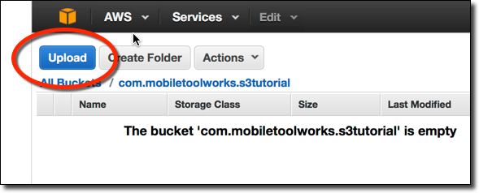

Next select a file from your computer to upload and save it.  I've uploaded a single image to the S3 bucket.  After you save the file, it will be in the S3 bucket list, as below.

At this point we have a bucket with a file to display in our iOS app.  Next we need to create an authorization using Cognito so the mobile app will be able to read the file from the bucket.

<h1 id="creatingacognitoidentitypool">Creating a Cognito Identity Pool</h1>

Cognito is the AWS authorization facility used to provide remote application authentication for AWS resources. Once a user is authorized with Cognito, the Identity and Access Management service is used to map authorizations between Cognito authorized users and AWS resources.

Cognito can support both unauthenticated and authenticated users simultaneously. It can delegate authentication to various Identity systems, like Google, Twitter and your custom authentication provider to meet various requirements.

In this introductory tutorial, we'll use an unauthenticated identity -- essentially letting anyone who uses our app to access the image we put in the S3 bucket.  This is common for B2C applications. Layering user authentication on top of this design can certainly be done without changing the basic design of the app.

With that introduction, let's setup Cognito!  First navigate back to the AWS Management Console, and then click the link to Cognito underneath the Mobile Services heading.

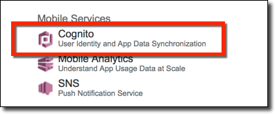

At the top of the Amazon Cognito console, click the New Identity Pool button.

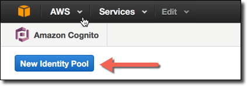

On the first step screen:

<ul>
<li>Give the identity pool a name (which must be unique in your account)</li>
<li>Click the checkbox to allow unauthenticated identities. This will enable us to authorize our app to read from the S3 bucket without authenticating users with an authentication provider</li>
<li>Click the create pool button</li>
</ul>

If our application was to be restricted to authenticated users only, we would use the to define Public, OpenID and/or Developer Authenticated Identities sections to integrate Cognito with the authentication provider we chose to use.

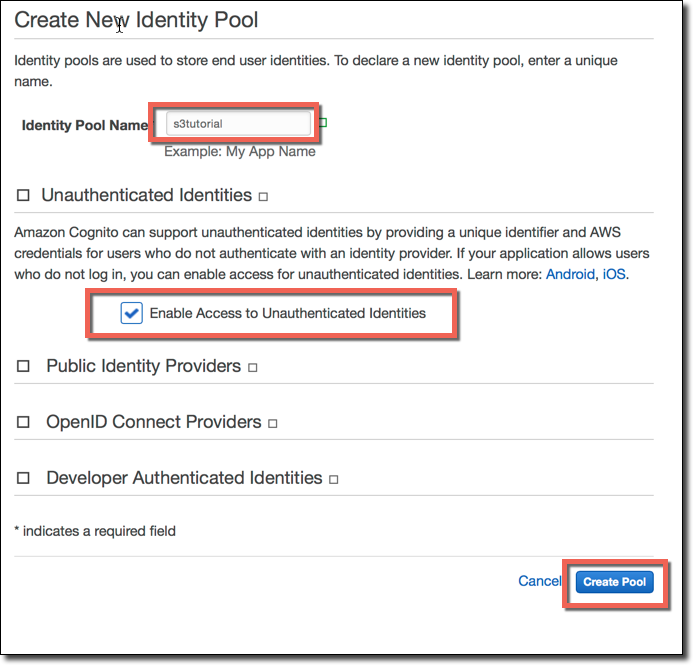

On the next screen (step 2), by default you'll create two Identity and Access Management (IAM) roles -- one for authenticated users, and the other for unauthenticated users.  As you can probably guess, authenticated users can have different privileges to AWS resources than unauthenticated ones.  In an application like ours, we might allow unauthenticated users to view images, but only authenticated users to upload images.

The default settings on this screen are fine and the names are sensible for our purposes.  Review the screen, and click the Update Roles button.

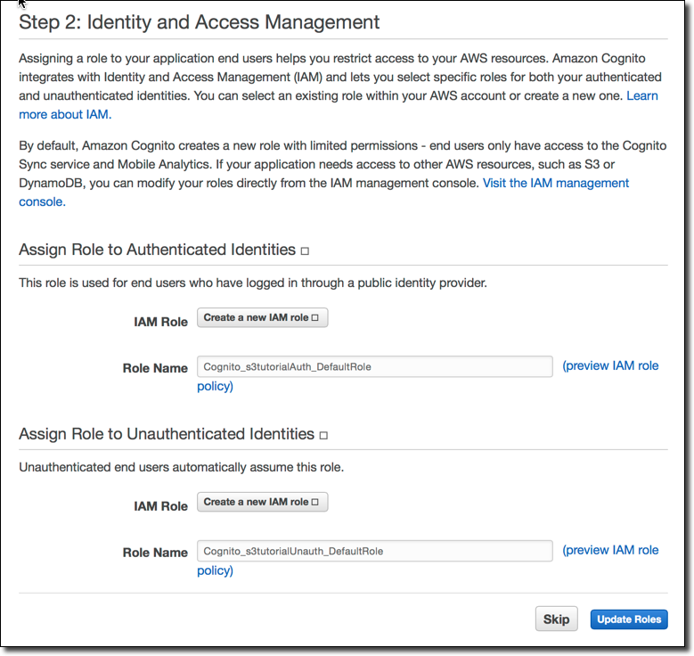

<h2 id="useiamtoauthorizetheunauthenticatedrolefors3">Use IAM to Authorize the unauthenticated role for S3</h2>

Next we need to authorize app users who use the Cognito role we created to have read access to the image we uploaded to the S3 bucket.

Head over to the IAM Management Console, click on the Roles link in the left-hand navigation, then click on the unauthenticated role you created in the previous step (in this example it's called Cognito<em>s3tutorialUnauth</em>DefaultRole).

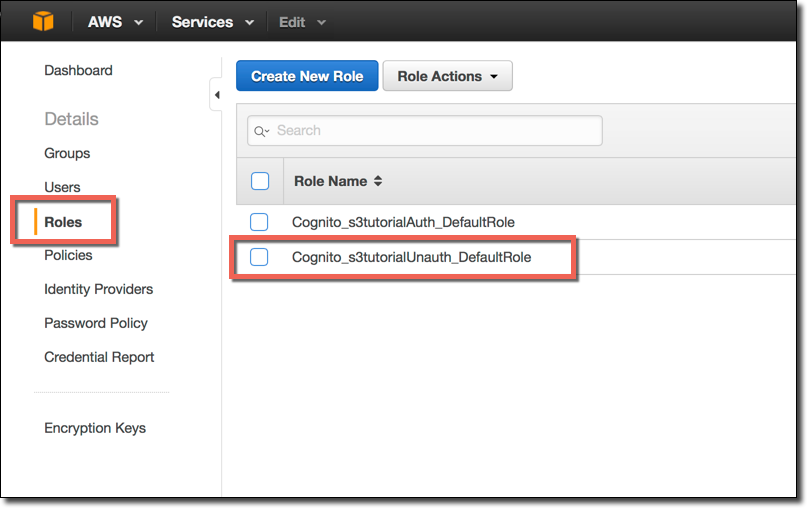

On the next screen, you can see the role and policies that were assigned when the role was created.  By default, there is a role policy that allows user profile data to be saved.

Before going further, make a note of the Role ARN, and copy it to the clipboard, then save it in a text editor.  You'll need this later when configuring your iOS application in XCode.

Once you copy the ARN, click the Create Role Policy button to create the role that will allow reading of the S3 bucket images.

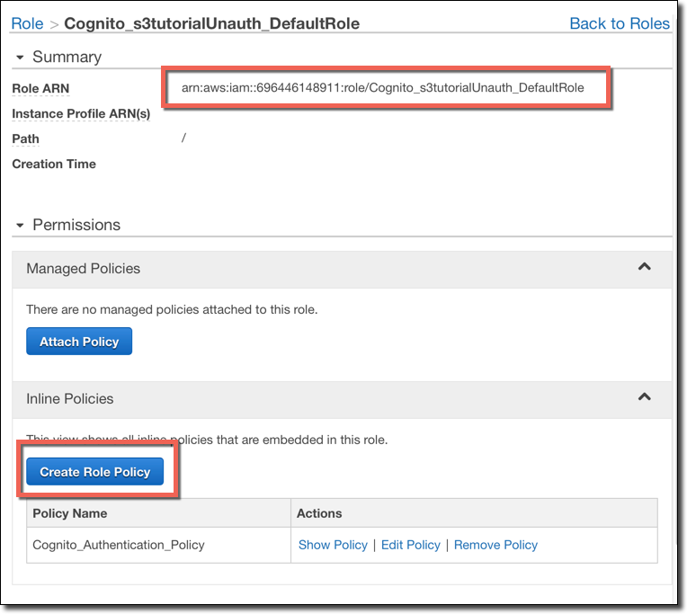

The Set Permissions form allows you to use a Policy Generator or a Custom Policy. Click the Select button to choose the former option so we can use a configuration GUI to generate the policy instead of typing in the JSON syntax by hand.

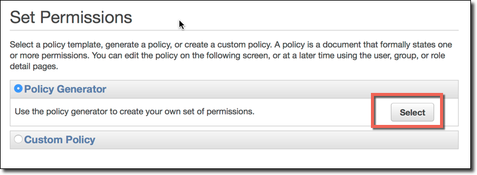

In the Policy Generator make the following selections:

<ul>
<li>Select Amazon S3 as the AWS Service</li>
<li>Select only the GetObject action</li>
<li>Enter the ARN for the S3 bucket we created, in this format: arn:aws:s3:::com.mobiletoolworks.s3tutorial/*</li>
<li>Click the Add Statement button.  </li>
<li>After you click this button, the statement will be added to a table underneath the entry fields</li>
<li>Verify the statement looks correct, and then click the Next Step button</li>
</ul>

The next page shows you a JSON version of the policy created in the dialog box.  
Click the Apply Policy button.

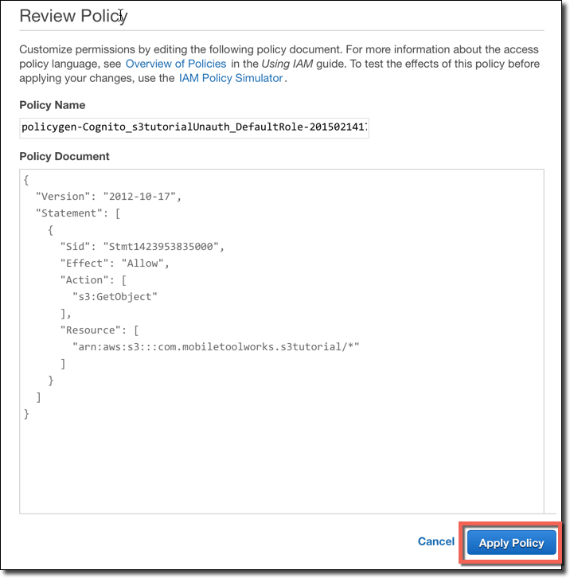

After you Apply the Policy, you're returned to the role summary screen. Note the new policy you added for the application is now listed in the Policy list at the bottom of the form.

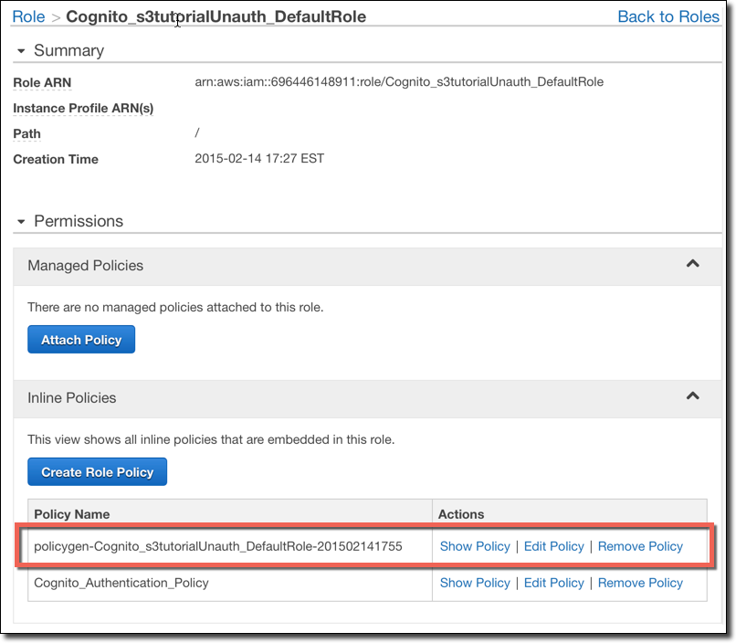

<h2 id="createthexcodeproject">Create the XCode Project</h2>

Now that we have the AWS Backend Service created and configured, let's create our iOS Application and configure it to read from the S3 Bucket.

Launch XCode, select File/New Project, select Single View Application, and click the Next button.

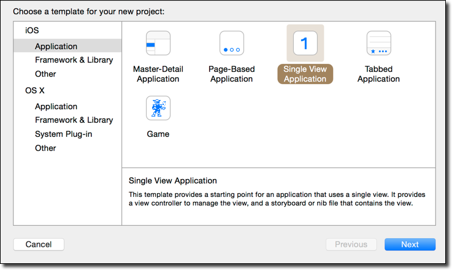

Give your project a name, set the language to Swift, choose iPhone as the device, clear the User Core Data checkbox and click the Next button.

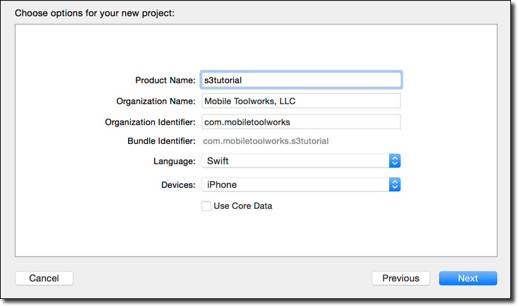

<h2 id="usecocoapodstoaddawsframeworks">Use CocoaPods to add AWS frameworks</h2>

Next we need to add the Amazon AWS frameworks to the XCode project.  You can download frameworks and add them manually if you like, but it's much easier to use the CocoaPods dependency manager to do it for you.

If you don't have CocoaPods configured on your system, follow these instructions to configure your XCode environment to use it.

Create a file named "podfile" in your project root folder, and add the following lines to it:

<pre><code>source 'https://github.com/CocoaPods/Specs.git'  
pod 'AWSiOSSDKv2'  
</code></pre>

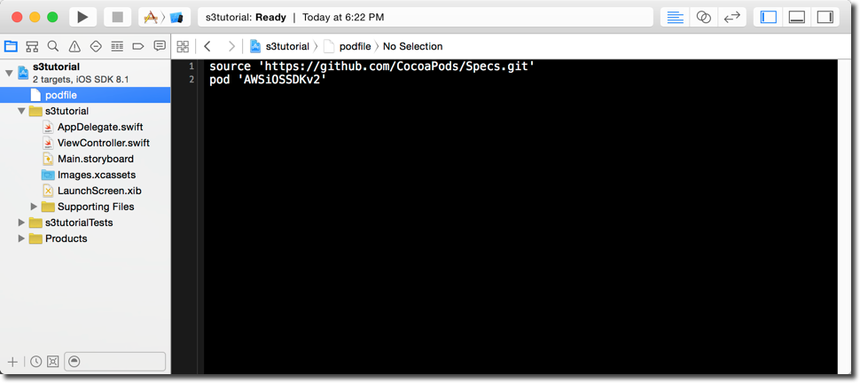

Then close XCode, open a terminal window, and navigate to the folder where you created your podfile.

From that folder, type the following command to have CocoaPods:

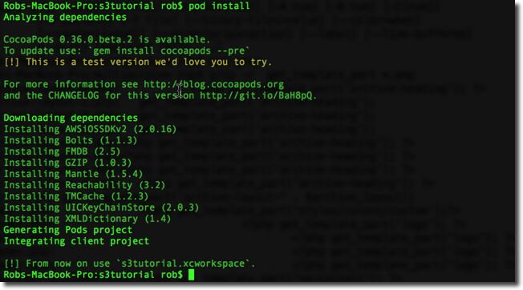

Now wait while CocoaPods downloads the AWS SDK (and dependencies), and configures your XCode workspace.

After the workspace is configured, note the instruction on the console that you should now open your project by double-clicking on the .xcworkspace file rather than the .xcodeproj file as you did previously.

Double-click the .xcworkspace file to re-open the XCode project. Note how CocoaPods has configured the AWS runtime libraries for you within the XCode workspace.  
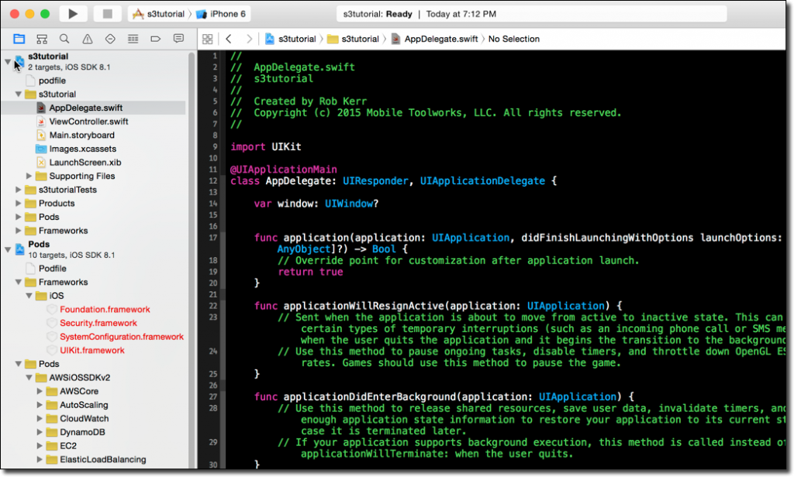

Since we're using Swift, and the AWS libraries are actually Objective-C, we need to create a bridging header, and configure the project for it.

First, add a bridging header to you iPhone app.  I've called mine "BridgingHeader.h", but you can use any name you like.

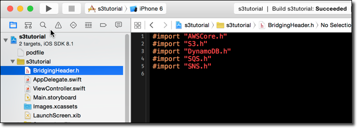

To configure the project to use the Bridging Header, click on your iPhone app target, click on Build Settings, and search for the word "Bridging".  Then change the setting for Objective-C Bridging Header to the name you gave your Bridging Header file.  
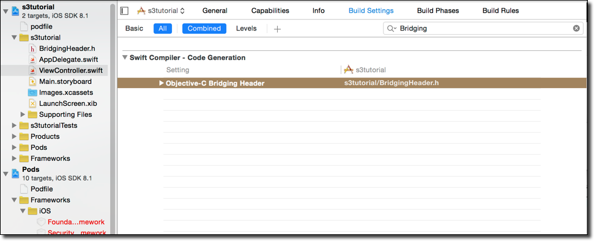

The project is now configured for AWS, so next let's implement some code to connect to AWS, download and display the file we uploaded at the beginning!

<h2 id="connectingtoaws">Connecting to AWS</h2>

Since our objective is to retrieve the image file uploaded to the S3 bucket, the first thing we'll do is put a UIImageView on the main screen's view controller so we can display the image once we have it.

Open your Main.storyboard, drag an Image View from the Object Library on to the main View Controller Scene.  Then create an outlet in the ViewController class for the UIImageView.  I assume you know how to do this, so I won't go through all the steps in detail.

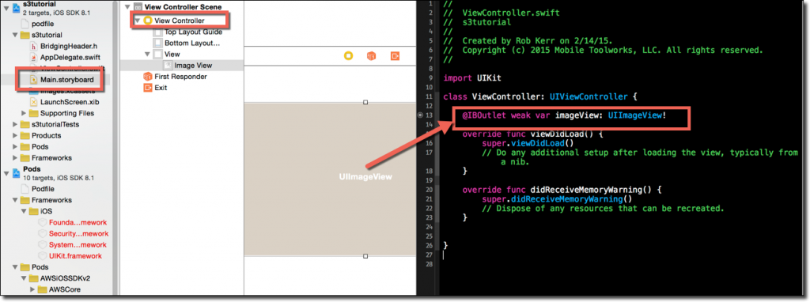

Now that you have a UIImageView where the image will be displayed, replace the viewDidLoad() method with the following.  Of course, this is just a tutorial--a production application wouldn't do all of this in viewDidLoad, but this will at least let you test your AWS connection and make sure you've got the hang of configuring your project and can use Swift to connect to AWS services.
